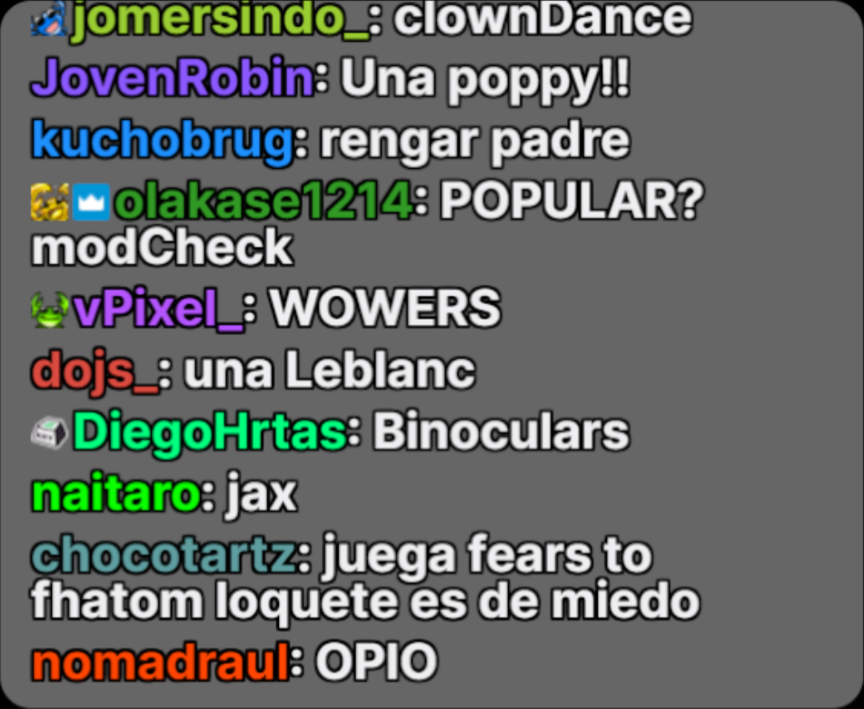
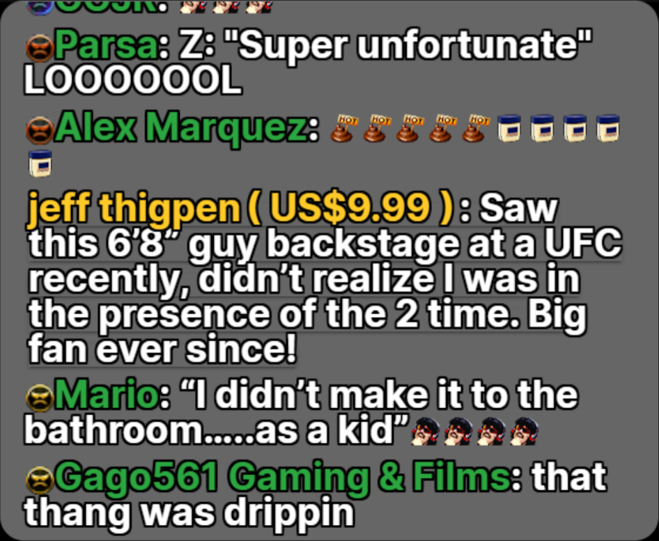

# Forked from [t-wy](https://github.com/t-wy/Live-Chat-CSS-Templates)
I knew it could be done, but I would not have known where to start. A big thanks to t-wy for getting me so close to where I wanted to go.
I just didn't want to use StreamLabs. Why not just customize my chat directly from Twitch?

## Changes
I haven't so much as looked at the Youtube template.

For the Twitch template:
- I noticed that highlighted messages weren't being displayed and I've fixed that, but at the moment it could still look better.
- I also wanted to start the text of a chat message on the line below the person's name to help with readability in the case of a very narrow browser source pane.
- I would like to add more variables near the top for ease of customization, such as font colors, font family, opacity, etc.

## What follows is from t-wy's original README.md
The images have not been updated.

# Live-Chat-CSS-Templates
Live Chat CSS Templates for Twitch, Youtube, ... as pop-up / OBS Browser Source

## Sample (Black Background, White overlay, 40% Opacity):

### Twitch

Source: [ibai's Channel](https://www.twitch.tv/ibai) ([Popup](https://www.twitch.tv/popout/ibai/chat?popout=))

### Youtube

Source: [DrDisRespect's Livestream](https://www.youtube.com/watch?v=tbmP4XNWMHA) ([Popup](https://www.youtube.com/live_chat?is_popout=1&v=tbmP4XNWMHA))

