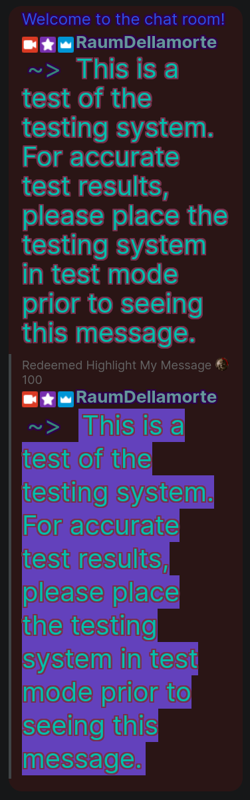
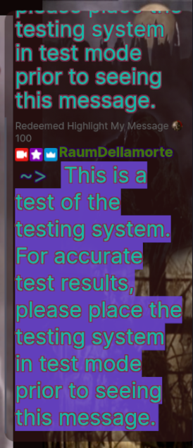

# Forked from [t-wy](https://github.com/t-wy/Live-Chat-CSS-Templates)
I knew it could be done, but I would not have known where to start. A big thanks to t-wy for getting me so close to where I wanted to go.
I just didn't want to use StreamLabs. Why not just customize my chat directly from Twitch?

## Changes
I haven't so much as looked at the Youtube template. Changes like those I made to the Twitch template are planned.

For the Twitch template:
- I noticed that highlighted messages weren't being displayed and I've fixed that.
- I also wanted to start the text of a chat message on the line below the person's name to help with readability in the case of a very narrow browser source pane.
- I added more variables near the top for ease of customization:
  - ```css
    /* Convenience Variables for basic customization. These are the settings in the picture below */
    /* Chat message settings */
    --message-color: rgb(0, 192, 173);
    --message-outline-color: rgb(119, 49, 77);
    --message-line-height: 44px;
    --message-font-size: 40px;
    /* --message-pointer points to the start of a chat message. This should work with any unicode characters, untested */
    --message-pointer: "~> ";
    --message-pointer-color: rgb(54, 135, 119);
    /* Highlighted message settings */
    --highlight-color: var(--message-color);
    --highlight-outline-color: rgb(119, 49, 77);
    --highlight-bg-color: rgba(114, 76, 230, 0.80); 
    /* Server message settings like "Welcome to the chat room!" line sent by the server */
    --server-message-color: rgb(43, 80, 230);
    --server-message-outline-color: rgb(45, 0, 75);
    --server-message-line-height: 28px;
    --server-message-font-size: 24px;
    /* Notices from Twitch, like 'Redeemed Highlight My Message' */
    --notice-color: rgb(99, 99, 99);
    /* Twitch Username settings. No --username-color: Username font colors are random */
    --username-outline-color: rgb(45,0,75);
    /* The shadow vars are constructed with their respective outline vars above and are really long, thus the ... */
    --message-shadow: ...;
    --highlight-shadow: ...;
    --username-shadow: ...;
    --server-message-shadow: ...;
    ```
_I like obnoxious colors. If you don't like the color scheme it's trivial to change._

 

_On the left, Twitch Chat Popout in Firefox modified by CSS. On the right, the same in OBS on my actual stream setup to demo transparency and show how much text fits in a 400x840 OBS Browser Source._

## What follows is from t-wy's original README.md
The images have not been updated.

# Live-Chat-CSS-Templates
Live Chat CSS Templates for Twitch, Youtube, ... as pop-up / OBS Browser Source

## Sample (Black Background, White overlay, 40% Opacity):

### Twitch

Source: [ibai's Channel](https://www.twitch.tv/ibai) ([Popup](https://www.twitch.tv/popout/ibai/chat?popout=))


### Youtube

Source: [DrDisRespect's Livestream](https://www.youtube.com/watch?v=tbmP4XNWMHA) ([Popup](https://www.youtube.com/live_chat?is_popout=1&v=tbmP4XNWMHA))


